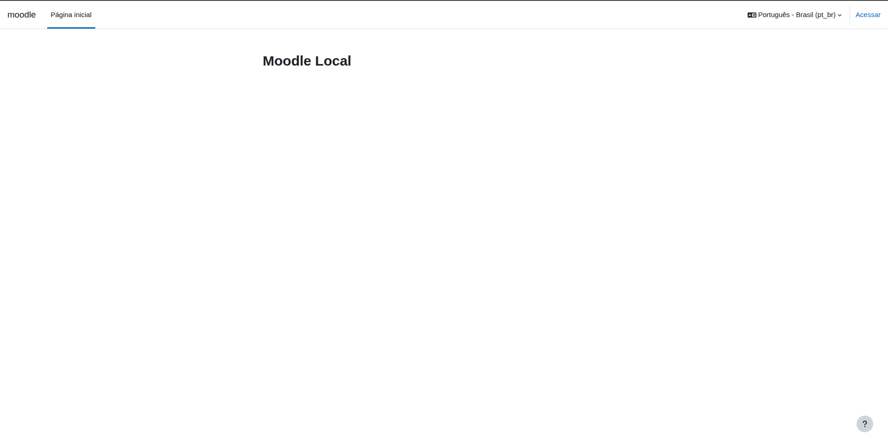
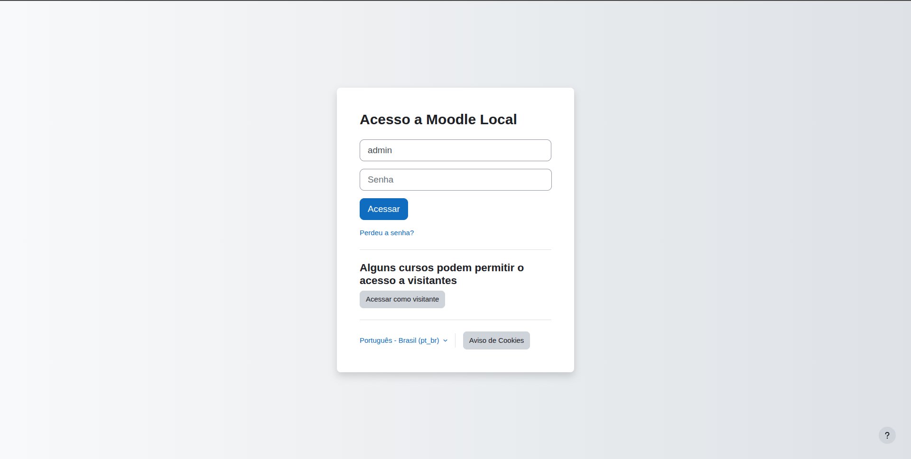
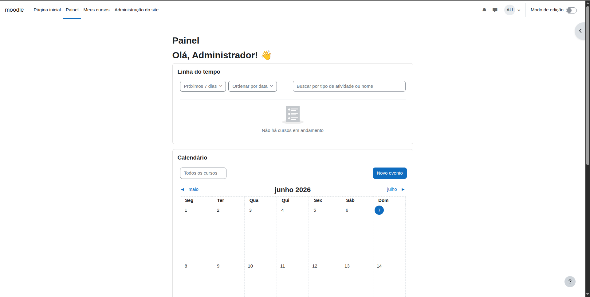
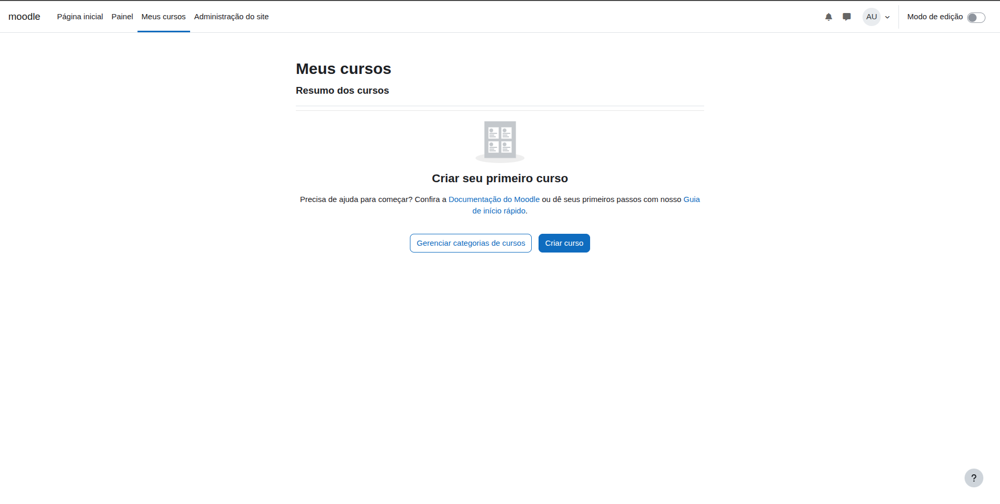
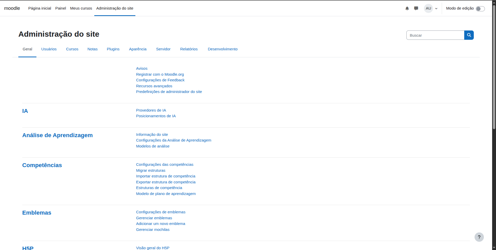
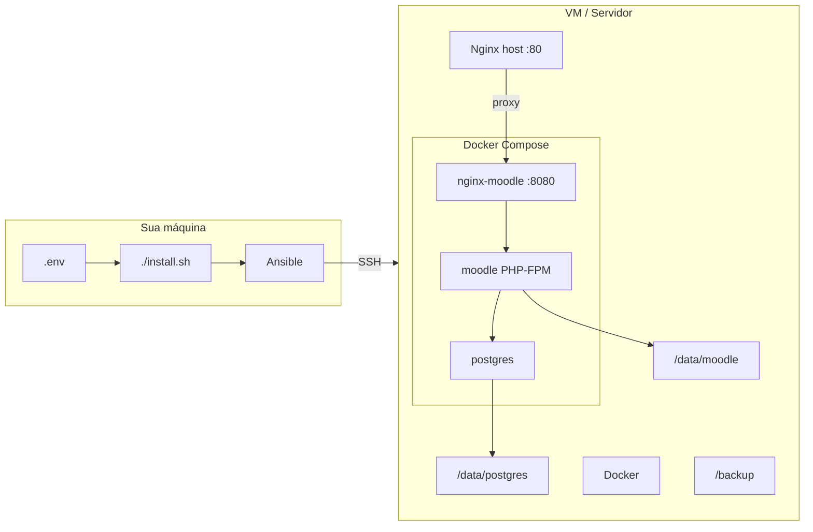

# Moodle Infra

Automatizador de instalação do **Moodle** em **Ubuntu Server 22.04 LTS** usando **Ansible** e **Docker**.

O repositório provisiona a VM, sobe a stack (Moodle + PostgreSQL + Nginx), instala o Moodle via CLI e aplica hardening básico — tudo configurável por um único arquivo `.env`.

### Requisitos do servidor

| Item | Versão / valor |
|---|---|
| **Sistema operacional** | **Ubuntu Server 22.04 LTS** (versão oficial deste projeto) |
| Arquitetura | amd64 (x86_64) |
| Acesso | SSH por chave + sudo |
| Rede | Internet (apt, Docker, clone do Moodle) |

> Este projeto foi desenvolvido e testado em **Ubuntu 22.04 LTS**. Outras versões do Ubuntu ou Debian podem funcionar, mas não são oficialmente suportadas.

### Resumo prático — comece por aqui

No Ubuntu 22.04, após um preparo mínimo, o comando principal é:

```bash
./install.sh
```

Não é “zero configuração”, mas o fluxo é direto:

```
VM Ubuntu 22.04 + SSH + .env preenchido  →  ./install.sh  →  Moodle no ar
```

#### Antes de executar (uma vez)

**Na VM Ubuntu 22.04:**

- Usuário com **sudo** (de preferência NOPASSWD)
- **SSH por chave** funcionando
- `python3` instalado
- Internet liberada

**Na sua máquina (control node):**

```bash
sudo apt install -y ansible gettext-base
cp .env.example .env
nano .env   # IP, usuário, senhas, MOODLE_WWWROOT, etc.
```

#### O que o `./install.sh` faz automaticamente

- Valida o `.env` e gera o inventory
- Instala Docker, Nginx e a stack Moodle
- Instala o Moodle via CLI (`install.php`)
- Aplica hardening básico (Docker + SSH)

#### Após o install

1. Acesse a URL definida em `MOODLE_WWWROOT` no navegador
2. Faça login com `MOODLE_ADMIN_USER` / `MOODLE_ADMIN_PASSWORD`

#### O que ainda exige passo extra

| Item | Quando usar |
|---|---|
| `./ssl.sh` | Produção com domínio real e HTTPS |
| Firewall (UFW) | Não ativo por padrão — ver seção SSL/UFW |
| `AllowUsers` no SSH | Padrão: `renan` — ajuste se seu usuário for outro |
| DNS / domínio | Configurar manualmente no `.env` |

#### Lab vs produção

| Ambiente | Fluxo |
|---|---|
| **Lab (IP)** | `.env` → `./install.sh` → acessar no navegador |
| **Produção (domínio)** | `.env` → `./install.sh` → `./ssl.sh` → `./install.sh` |

---

### Prévia

| Página inicial | Login |
|:---:|:---:|
|  |  |

| Painel do administrador | Meus cursos |
|:---:|:---:|
|  |  |

| Administração do site |
|:---:|
|  |

---

## Arquitetura



| Componente | Função |
|---|---|
| **Nginx (host, porta 80)** | Proxy reverso — URL pública de acesso |
| **Nginx (Docker, porta 8080)** | Serve arquivos estáticos e encaminha PHP |
| **Moodle (Docker)** | PHP 8.3-FPM com código Moodle 4.5 |
| **PostgreSQL (Docker)** | Banco de dados |
| **Ansible** | Orquestra instalação e configuração |

---

## Parte 1 — Antes de rodar o Ansible

### 1.1 Na VM recém-criada

Após criar a VM com **Ubuntu Server 22.04 LTS**, configure o acesso SSH e os pré-requisitos mínimos.

#### Criar usuário com sudo (se ainda não existir)

```bash
# Na VM, como root ou via console da hypervisor
# seu_usuario é o usuário da vm
adduser seu_usuario
usermod -aG sudo seu_usuario
```

#### Configurar acesso por chave SSH

Na **sua máquina local**:

```bash
# Gerar chave (se ainda não tiver)
ssh-keygen -t ed25519 -C "ansible-moodle"

# Copiar chave para a VM
ssh-copy-id -i ~/.ssh/id_ed25519.pub seu_usuario@IP_DA_VM
```

Teste o acesso:

```bash
ssh seu_usuario@IP_DA_VM
```

#### Sudo sem senha (recomendado para Ansible)

Na VM, crie o arquivo sudoers:

```bash
sudo visudo -f /etc/sudoers.d/seu_usuario
```

Conteúdo:

```
seu_usuario ALL=(ALL) NOPASSWD:ALL
```

> Sem isso, o Ansible precisará da flag `-K` para pedir senha de sudo a cada execução.

#### Pacotes mínimos na VM

O Ansible instala quase tudo, mas a VM precisa de:

- `python3` (já vem no Ubuntu Server)
- Acesso à internet (para `apt` e clone do Moodle)

```bash
sudo apt update && sudo apt install -y python3
```

---

### 1.2 Na sua máquina local (control node)

Instale as ferramentas necessárias:

```bash
# Ubuntu/Debian
sudo apt update
sudo apt install -y ansible gettext-base

# Verificar
ansible --version
envsubst --version
```

Clone ou acesse o repositório:

```bash
cd moodle-infra
```

---

### 1.3 Configurar o `.env`

```bash
cp .env.example .env
nano .env   # ou seu editor preferido
```

O script `bin/load-env.sh` valida as variáveis obrigatórias e gera automaticamente o `inventory/hosts.ini` a partir do template.

---

## Parte 2 — Configurações iniciais (o que alterar no `.env`)

### Obrigatórias — altere antes da primeira instalação

| Variável | Descrição | Exemplo |
|---|---|---|
| `MOODLE_HOST` | IP ou hostname da VM | `172.11.80.132` |
| `ANSIBLE_USER` | Usuário SSH da VM | `seu_usuario` |
| `ANSIBLE_SSH_PRIVATE_KEY_FILE` | Caminho da chave privada | `~/.ssh/id_ed25519` |
| `MOODLE_DOMAIN` | Nome usado pelo Nginx (`server_name`) | `172.11.80.132` ou `moodle.escola.com` |
| `MOODLE_WWWROOT` | **URL que o usuário digita no navegador** | `http://172.11.80.132` |
| `MOODLE_ADMIN_PASSWORD` | Senha do admin criado na instalação | senha forte |
| `MOODLE_ADMIN_EMAIL` | E-mail do administrador | `admin@escola.com` |
| `MOODLE_DB_PASSWORD` | Senha do PostgreSQL | senha forte |

### Importantes — revise e ajuste

| Variável | Descrição | Padrão |
|---|---|---|
| `MOODLE_PORT` | Porta interna do Docker Nginx | `8080` |
| `MOODLE_SITE_FULLNAME` | Nome completo do site | `"Minha Plataforma Moodle"` |
| `MOODLE_SITE_SHORTNAME` | Nome curto | `moodle` |
| `MOODLE_ADMIN_USER` | Login do administrador | `admin` |
| `MOODLE_LANG` | Idioma da instalação | `pt_br` |
| `MOODLE_VERSION` | Branch do Moodle no GitHub | `MOODLE_405_STABLE` |
| `TIMEZONE` | Fuso horário do servidor | `America/Sao_Paulo` |

### Avançadas — geralmente mantém o padrão

| Variável | Descrição | Padrão |
|---|---|---|
| `MOODLE_DATA_DIR` | Arquivos do Moodle no servidor | `/data/moodle` |
| `POSTGRES_DATA_DIR` | Dados do PostgreSQL | `/data/postgres` |
| `BACKUP_DIR` | Diretório de backups | `/backup` |
| `POSTGRES_VERSION` | Versão da imagem Docker | `17` |
| `MOODLE_DB_NAME` | Nome do banco | `moodle` |
| `MOODLE_DB_USER` | Usuário do banco | `moodle` |
| `LETSENCRYPT_EMAIL` | E-mail do Certbot (obrigatório ao rodar `./ssl.sh`) | — |

---

### Regra de ouro: `MOODLE_WWWROOT`

O `MOODLE_WWWROOT` deve ser **exatamente** a URL que o usuário digita no navegador.

| Cenário | `MOODLE_WWWROOT` correto |
|---|---|
| Lab com IP, acesso pela porta 80 | `http://172.11.80.132` |
| Domínio real com DNS | `https://moodle.escola.com` |
| Domínio local (`/etc/hosts`) | `http://moodle.local` |

> **Não** inclua `:8080` no `MOODLE_WWWROOT` se o acesso público for pela porta 80 (Nginx do host faz proxy para o Docker).

Se o `MOODLE_WWWROOT` estiver errado, o Moodle entra em **loop de redirect** ou não carrega.

---

## Parte 3 — Instalação

### Instalação completa (primeira vez)

```bash
./install.sh
```

Equivalente a:

```bash
source bin/load-env.sh
ansible-playbook playbooks/server.yml
```

### O que o `install.sh` faz

1. Carrega e valida o `.env`
2. Gera `inventory/hosts.ini`
3. Executa o playbook `server.yml` que aplica os roles:

| Ordem | Role | Ação |
|---|---|---|
| 1 | `common` | Pacotes base, timezone, diretórios |
| 2 | `docker` | Instala Docker e Compose |
| 3 | `docker_hardening` | Hardening do daemon Docker |
| 4 | `moodle` | Clone do código, Docker Compose, `install.php` |
| 5 | `nginx` | Nginx host como proxy reverso (porta 80) |
| 6 | `ssh_hardening` | Hardening SSH |

### Após a instalação

Acesse a URL definida em `MOODLE_WWWROOT`:

```
http://SEU_IP_OU_DOMINIO
```

Login com as credenciais do `.env`:

- **Usuário:** `MOODLE_ADMIN_USER` (padrão: `admin`)
- **Senha:** `MOODLE_ADMIN_PASSWORD`

#### O que você verá no navegador

1. **Página inicial** — site no ar, pronto para configurar cursos


2. **Tela de login** — clique em *Acessar* e entre com o admin do `.env`


3. **Painel** — área do administrador após o login


4. **Meus cursos** — gestão de cursos da plataforma


5. **Administração do site** — configurações avançadas do Moodle


---

## Parte 4 — Configurações adicionais

### SSL / HTTPS para produção (Let's Encrypt)

O repositório **suporta SSL em produção**, mas o HTTPS **não vem ativo por padrão** — em ambiente de lab/IP a instalação funciona só com HTTP. Para produção com domínio real, é preciso ativar e configurar manualmente.

#### O que já existe no repositório

| Recurso | Função | Status |
|---|---|---|
| `roles/ssl/` | Instala Certbot e gera certificado Let's Encrypt | Implementado |
| `playbooks/ssl.yml` | Playbook dedicado ao SSL | Implementado |
| `ssl.sh` | Atalho para rodar o playbook SSL | Implementado |
| `LETSENCRYPT_EMAIL` no `.env` | E-mail usado pelo Certbot | Configurável |
| `roles/security/tasks/ufw.yml` | Libera portas 22, 80 e 443 | Existe, **não ativo** no `server.yml` |

#### O que está desativado por padrão

No `playbooks/server.yml`, o role SSL vem comentado:

```yaml
#- ssl #tirar comentário quando tiver domínio
```

Isso é intencional: sem domínio e DNS válidos, o Certbot falharia na instalação de lab.

#### Como o SSL funciona (arquitetura)

O Certbot atua no **Nginx do host** (portas 80/443), não no Nginx do Docker:

```
Internet
   │
   ▼
Nginx host (:80 / :443)   ← Certbot configura HTTPS aqui
   │ proxy
   ▼
Docker Nginx (:8080)
   │
   ▼
Moodle (PHP-FPM) + PostgreSQL
```

O comando `certbot --nginx` altera automaticamente o arquivo `/etc/nginx/sites-available/moodle` no servidor, adicionando o bloco HTTPS e o redirecionamento HTTP → HTTPS.

#### Pré-requisitos para produção

- Domínio real com **DNS apontando para o IP da VM** (ex.: `moodle.escola.com` → `203.0.113.10`)
- Portas **80** e **443** liberadas no firewall (cloud ou UFW na VM)
- E-mail válido em `LETSENCRYPT_EMAIL` (notificações de expiração do certificado)
- `MOODLE_WWWROOT` com `https://` após ativar o certificado

#### Passo a passo — ativar SSL em produção

**1. Ajuste o `.env`:**

```bash
MOODLE_DOMAIN=moodle.escola.com
MOODLE_WWWROOT=https://moodle.escola.com
LETSENCRYPT_EMAIL=admin@escola.com
```

**2. Reaplique a configuração base** (Nginx com domínio correto):

```bash
./install.sh
```

**3. Gere o certificado SSL** — escolha uma das opções:

*Opção A — playbook dedicado (recomendado na primeira vez):*

```bash
./ssl.sh
```

*Opção B — integrar ao install principal* — descomente no `playbooks/server.yml`:

```yaml
- ssl
```

E execute `./install.sh`.

**4. Sincronize o `wwwroot` HTTPS no Moodle:**

```bash
./install.sh
```

Isso atualiza o `config.php` com `MOODLE_WWWROOT=https://...`.

**5. Verifique no navegador:**

```
https://moodle.escola.com
```

#### O que o `./ssl.sh` faz

1. Instala `certbot` e `python3-certbot-nginx`
2. Executa `certbot --nginx -d MOODLE_DOMAIN` com o e-mail do `.env`
3. Cria cron de renovação automática (diariamente às 03:30)

#### Firewall (UFW) — opcional

Existe o role `roles/security/tasks/ufw.yml` que libera SSH (22), HTTP (80) e HTTPS (443), mas **não está incluído** no `server.yml`. Para ativar, adicione ao playbook:

```yaml
- security
```

> Em cloud (AWS, GCP, Azure), configure as regras de Security Group / Firewall equivalentes.

#### Lacunas e pontos de atenção

| Item | Situação |
|---|---|
| SSL no install padrão | Desativado — ativar manualmente em produção |
| UFW automático | Não incluído no fluxo principal |
| `LETSENCRYPT_EMAIL` | Não é obrigatório no `load-env.sh` (só necessário ao rodar SSL) |
| Template SSL no Nginx | Não há — o Certbot modifica o config do Nginx diretamente |
| Moodle após HTTPS | `./install.sh` sincroniza `wwwroot`; em cenários com proxy reverso adicional pode ser necessário `$CFG->sslproxy = true` no `config.php` |

#### Fluxo resumido — lab → produção

```
Lab (IP)                          Produção (domínio)
────────                          ──────────────────
MOODLE_WWWROOT=http://IP          MOODLE_WWWROOT=https://dominio.com
./install.sh                      ./install.sh
                                  ./ssl.sh
                                  ./install.sh  (sincroniza https)
```

---

### Backup manual

```bash
./backup.sh
```

Gera na VM, em `BACKUP_DIR` (padrão `/backup`):

- `db_AAAA-MM-DD.sql` — dump do PostgreSQL
- `moodledata_AAAA-MM-DD.tar.gz` — arquivos do Moodle

#### Ativar backup automático (cron)

No `playbooks/server.yml`, descomente:

```yaml
- backup
```

E reexecute `./install.sh`. O cron roda diariamente às 02:00.

---

### Reexecutar após mudanças no `.env`

| Tipo de mudança | Ação |
|---|---|
| Nginx, Docker, paths, senhas de infra | `./install.sh` |
| `MOODLE_WWWROOT` (Moodle já instalado) | `./install.sh` — sincroniza `config.php` automaticamente |
| Senha do admin Moodle | Alterar pelo painel do Moodle |
| Senha do banco | Requer atualização manual no `config.php` e PostgreSQL |

---

### Ajustar usuário SSH permitido (hardening)

O role `ssh_hardening` restringe o SSH ao usuário `renan` por padrão. Se seu usuário for outro, edite:

```
roles/ssh_hardening/tasks/main.yml
```

Linha `AllowUsers`:

```yaml
- { regexp: '^#?AllowUsers', line: 'AllowUsers SEU_USUARIO' }
```

---

## Parte 5 — Estrutura do projeto

```
moodle-infra/
├── .env.example          # Template de configuração
├── .env                  # Suas variáveis (não versionar)
├── install.sh            # Instalação principal
├── backup.sh             # Backup manual
├── ssl.sh                # Certificado SSL
├── bin/load-env.sh       # Carrega .env e gera inventory
├── ansible.cfg           # Configuração do Ansible
├── inventory/
│   └── hosts.ini.template
├── group_vars/
│   └── moodle.yml        # Mapeamento .env → Ansible
├── playbooks/
│   ├── server.yml        # Playbook principal
│   ├── backup.yml
│   └── ssl.yml
└── roles/
    ├── common/           # Pacotes, timezone, diretórios
    ├── docker/           # Instalação do Docker
    ├── docker_hardening/ # Segurança do Docker
    ├── moodle/           # Stack Moodle + install.php
    ├── nginx/            # Proxy reverso (host)
    ├── ssh_hardening/    # Segurança SSH
    ├── ssl/              # Let's Encrypt
    └── backup/           # Backup PostgreSQL + moodledata
```

---

## Parte 6 — Solução de problemas

### Não conecta no navegador

1. Verifique se a VM está acessível: `ping IP_DA_VM`
2. Verifique SSH: `ssh renan@IP_DA_VM`
3. Confirme containers rodando na VM:

```bash
docker ps
```

Esperado: `postgres`, `moodle`, `nginx-moodle` com status `Up`.

### Loop de redirect / página não carrega

- Confirme que `MOODLE_WWWROOT` é a URL **sem porta extra** (se acessa pela 80)
- Reexecute `./install.sh` para sincronizar o `config.php`
- Limpe cache do navegador ou use aba anônima

### `moodle.local` não resolve

Para lab local, adicione no `/etc/hosts` **do seu PC**:

```
172.11.80.132 moodle.local
```

Ou use o IP diretamente no `MOODLE_WWWROOT`.

### PostgreSQL em restart loop

Causa comum: permissões incorretas em `/data/postgres`. Reexecute `./install.sh` — o role `common` corrige ownership (`999:999`).

### Ansible pede senha (`-K`)

Seu usuário não tem sudo sem senha. Configure NOPASSWD (seção 1.1) ou execute:

```bash
./install.sh -K
```

### Variável obrigatória não definida

```bash
cp .env.example .env
# Edite e preencha todas as variáveis da seção "Obrigatórias"
```

---

## Referência rápida de comandos

```bash
# Primeira instalação
cp .env.example .env && nano .env
./install.sh

# Reaplicar configuração
./install.sh

# Backup
./backup.sh

# SSL (com domínio real)
./ssl.sh

# Verificar sintaxe do playbook
source bin/load-env.sh
ansible-playbook playbooks/server.yml --syntax-check

# Modo dry-run (sem aplicar mudanças)
./install.sh --check
```

---

## Fluxo resumido (VM nova → Moodle no ar)

Checklist rápido — detalhes na seção [Resumo prático](#resumo-prático--comece-por-aqui) no início do documento.

```
1. Criar VM Ubuntu Server 22.04 LTS
2. Configurar SSH por chave + sudo NOPASSWD
3. Na máquina local: apt install ansible gettext-base
4. cp .env.example .env → preencher variáveis
5. ./install.sh
6. Acessar MOODLE_WWWROOT no navegador
7. Login com MOODLE_ADMIN_USER / MOODLE_ADMIN_PASSWORD
```

**Produção com HTTPS:** após o passo 5, execute `./ssl.sh` e rode `./install.sh` novamente.
